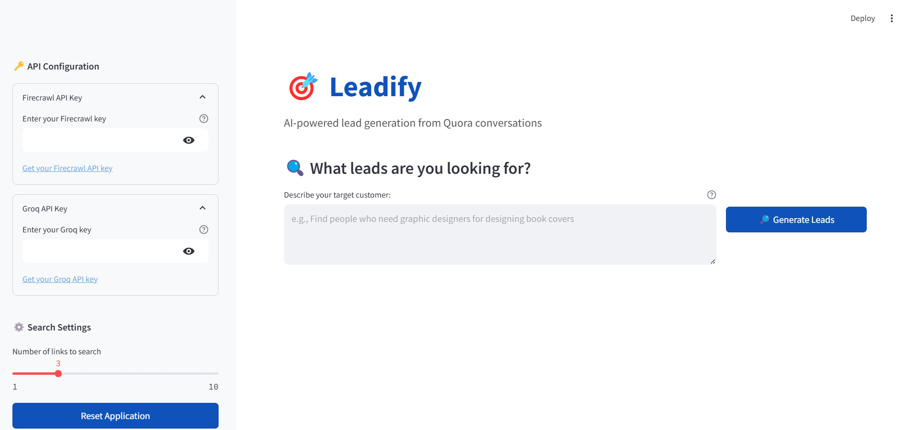
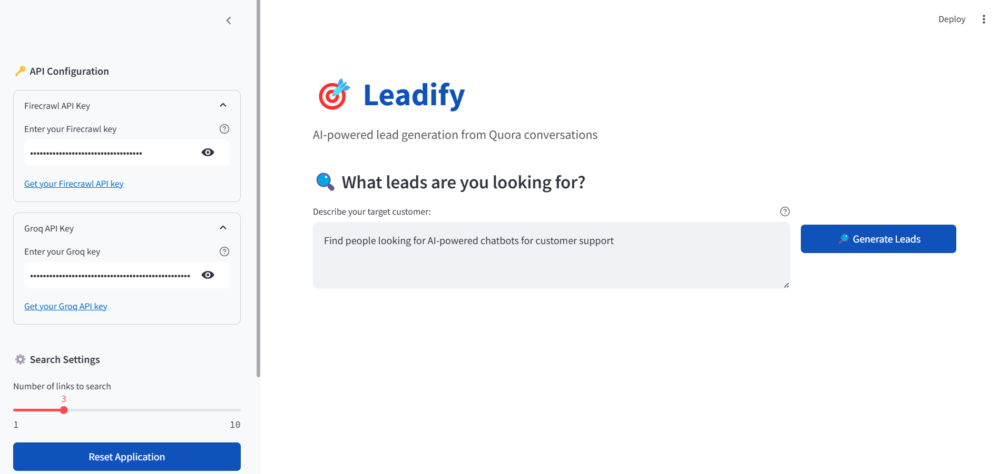
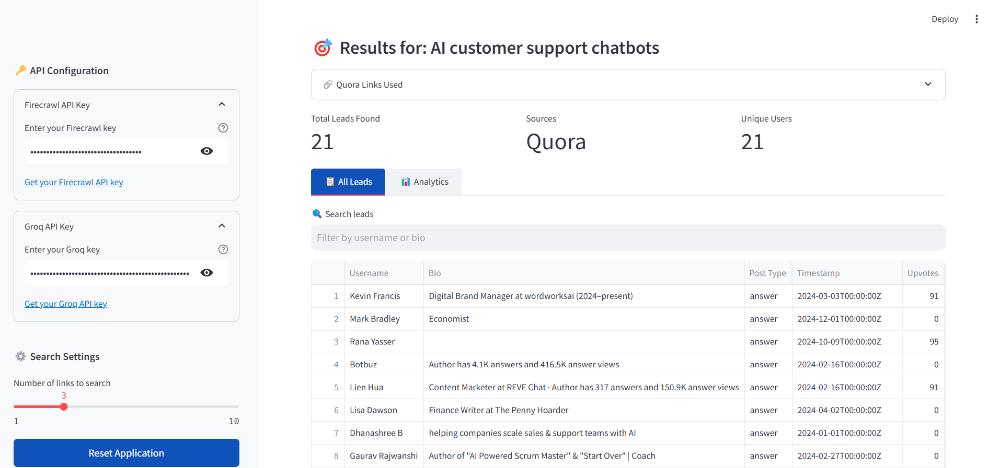
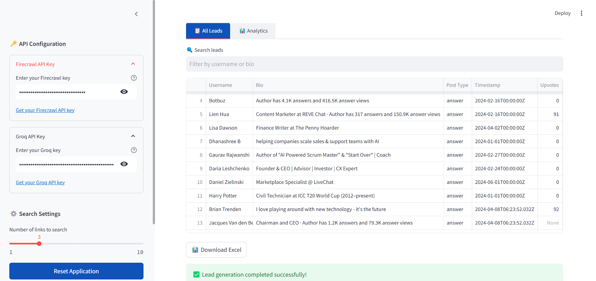
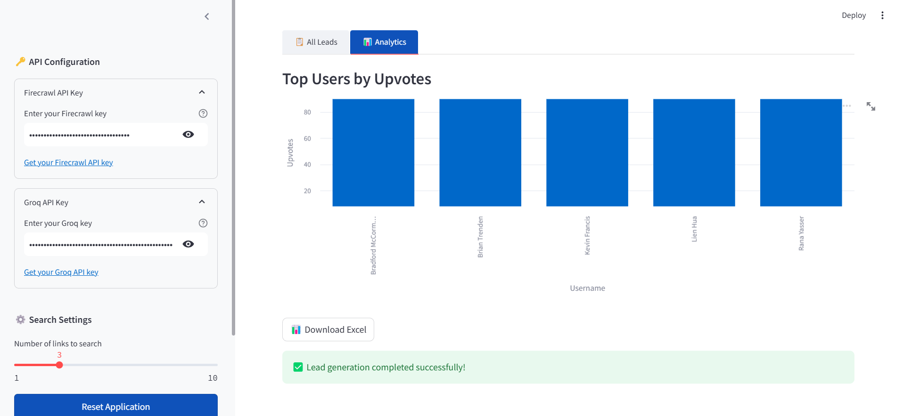

# Leadify 🔍 – AI-Powered Lead Generation using Agentic AI

**Leadify** is an AI-driven lead generation assistant that autonomously finds and filters potential leads based on your custom criteria. Built using the Agentic AI approach, it allows for modular, explainable, and flexible lead scraping by coordinating agents with defined roles and memory.

---

## 🧠 Key Features

- ✅ **Agentic Architecture** – Decentralized design using multiple AI agents
- 🗃️ **Memory-based Iteration** – Tracks intermediate steps for context-aware reasoning
- 🎯 **Custom Lead Criteria** – Accepts dynamic prompts and goals
- 🖼️ **Visual Output** – Clearly displays structured lead results
- ⚙️ **Simple Interface** – Easy-to-use form to input search criteria and launch the agent

---

## 📸 App Preview

**Main Page**  


**Passing Arguments to the Agent**  


**Generated Results (Sample)**  
| Result 1 | Result 2 | Result 3 |
|---------|---------|---------|
|  |  |  |

---

## ⚙️ How It Works

### 🧩 Agentic Pipeline

1. **User Input**: You provide the goal or criteria (e.g., “Find top LinkedIn leads in AI startups”).
2. **Agent Planning**: The AI agent parses the goal and creates subtasks like searching, scraping, and validating.
3. **Memory Management**: Intermediate results are stored and referred to during the reasoning process.
4. **Lead Extraction**: Based on search and filters, structured lead data is compiled.
5. **Final Output**: Results are displayed in a user-friendly format.

---

## 🚀 How to Run Locally

1. **Clone the repository**
   ```bash
   git clone https://github.com/yourusername/leadify.git
   cd leadify
   ```

2. **Install dependencies**
   ```bash
   pip install -r requirements.txt
   ```

3. **Run the app**
   ```bash
   streamlit run app.py
   ```

---

## 🏗️ Project Structure

```
leadify/
│
├── app.py                # Streamlit UI with agent integration
├── res/                  # All UI images for documentation
│   ├── main_page.png
│   ├── passing_args.png
│   ├── result_1.png
│   ├── result_2.png
│   └── result_3.png
├── README.md
└── requirements.txt      # Python dependencies
```

---

## 📌 Future Improvements

- Add lead export (CSV, PDF)
- Integrate LinkedIn or web scraping
- Support multi-agent tasking (planning, validation, refinement)
- Add support for different AI models and tools

---

## 🙌 Acknowledgements

This app is inspired by the **Agentic AI** paradigm which emphasizes autonomous, modular AI systems capable of long-term planning and memory-aware execution.

---

## 📫 Contact

**Creator** – [Tarun K T](https://www.linkedin.com/in/tarunkt/)  
📧 Feel free to connect or reach out if you'd like to collaborate!
