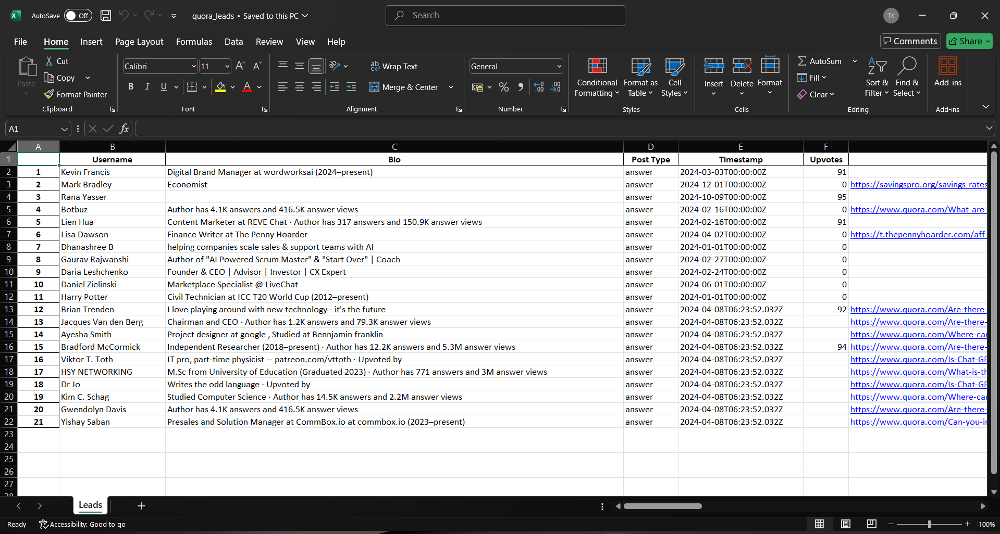

# 🎯 Leadify - AI Lead Generation from Quora


**Leadify** is an AI-powered lead generation application that automatically discovers potential leads from Quora conversations. Using **Firecrawl** for intelligent web search and extraction and **Groq** for natural language processing, Leadify creates a streamlined system for identifying and organizing qualified leads with minimal effort.

---

## 🚀 Features

- **🔍 Intelligent Query Processing**  
  Transforms detailed user queries into focused search parameters using Groq's LLM capabilities  

- **🌐 Targeted Search**  
  Uses Firecrawl's search endpoint to find relevant Quora discussions based on your business needs  

- **🤖 Automated Extraction**  
  Leverages Firecrawl's Extract endpoint to pull structured user information from Quora profiles  

- **📊 Lead Analytics**  
  View metrics and insights about your generated leads at a glance  

- **⚙️ Customizable Search**  
  Control the depth and breadth of your lead research  

- **📥 Excel Export**  
  Download your leads in Excel format for seamless integration with your CRM or sales process  


---

## 🧠 How It Works

1. **Describe Your Target Customer**  
   Enter a detailed description of your ideal customer or their needs

2. **AI Processing**  
   The app uses Groq to transform your description into an optimized search query

3. **Smart Web Search**  
   Firecrawl searches Quora for relevant discussions matching your criteria

4. **Lead Extraction**  
   The app automatically extracts user profiles from these discussions

5. **Organized Results**  
   View your leads in a searchable table with key metrics and analytics

**Leadify Results (Sample)**  
| Result 1 | Result 2 | Result 3 |
|---------|---------|---------|
|  |  |  |

---

## ⚙️ Getting Started

### Prerequisites

- Python 3.8+
- Firecrawl API key → [Get Firecrawl Key](https://www.firecrawl.dev/app/api-keys)
- Groq API key → [Get Groq Key](https://console.groq.com/keys)

### Installation

1. **Clone the repository**:
   ```bash
   git clone https://github.com/tarun-kt-codes/Leadify--AI-Lead-Generation.git
   cd Leadify--AI-Lead-Generation
   ```

2. **Install dependencies**:
   ```bash
   pip install -r requirements.txt
   ```

3. **Run the application**:
   ```bash
   streamlit run app.py
   ```

4. **Open the app**:
   Visit `http://localhost:8501` in your browser

---

## 🧪 Usage

1. **Set API Keys** in the sidebar (Firecrawl + Groq)  
2. **Adjust Search Parameters** — number of Quora links to scan  
3. **Enter Query** — e.g., "Find people who want mobile apps for restaurants"  
4. **Click "Generate Leads"**  
5. **Browse Results** — filter, search, and analyze your extracted leads  
6. **Export as Excel** with a single click  



---

## 💡 Example Queries

- "Find people looking for AI-powered chatbots for customer support"
- "Generate leads interested in social media management services for small businesses"
- "Discover users who need video editing software for creating YouTube content"
- "Find potential clients looking for freelance web developers specializing in e-commerce stores"

---

## 🏗️ Tech Stack

- **Streamlit** – Frontend web interface  
- **Firecrawl API** – Real-time Quora crawling & scraping  
- **Groq API** – Query analysis and NLP generation  
- **Pandas** – Data wrangling  
- **Pydantic** – Data validation and schemas  

---

## 🙌 Acknowledgments

- [Firecrawl](https://www.firecrawl.dev/)
- [Groq](https://console.groq.com/)
- [Streamlit](https://streamlit.io/)

---

### ⭐ Like this project? Give it a star on GitHub and share it with your network!
